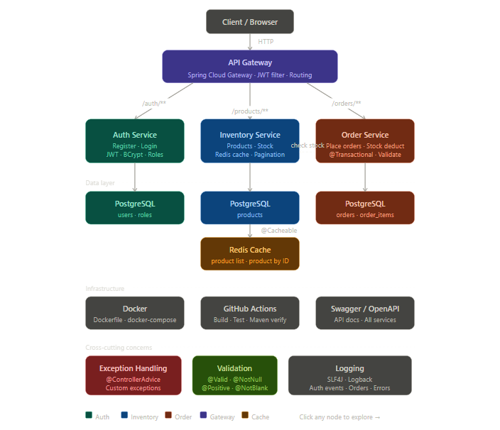
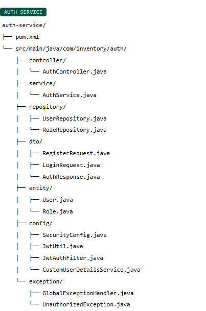
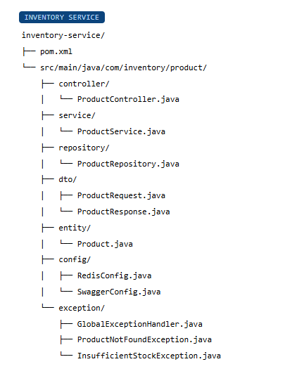
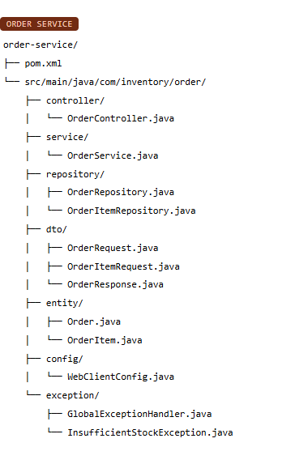
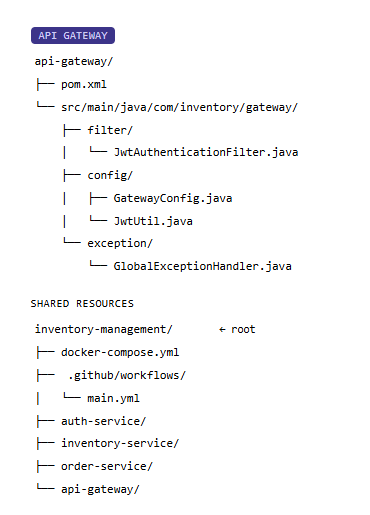

# Inventory Management Microservice System

A backend-focused Java microservice application built using Spring Boot, PostgreSQL, Redis, JWT Authentication, Docker, and Spring Cloud Gateway.

This project simulates a real-world scalable startup backend system with secure APIs, caching, centralized exception handling, transactional order processing, and CI/CD fundamentals.

---

# Project Architecture



---

# Microservices Architecture

The system follows a microservice-oriented architecture with independently deployable services.






## Services

### 1. Auth Service
Handles:
- User registration
- Login authentication
- JWT token generation
- Role-based authorization
- Spring Security Configuration

| Method | Endpoint       | Description   |
| ------ | -------------- | ------------- |
| POST   | /auth/register | Register User |
| POST   | /auth/login    | Login User    |


### 2. Inventory Service
- Features
- Add Product
- Update Product
- Delete Product
- Product Search
- Pagination & Sorting
- Redis Caching
- Validation Handling

| Method | Endpoint       | Description       |
| ------ | -------------- | ----------------- |
| POST   | /products      | Add Product       |
| GET    | /products      | Get All Products  |
| GET    | /products/{id} | Get Product By ID |
| PUT    | /products/{id} | Update Product    |
| DELETE | /products/{id} | Delete Product    |


### 3. Order Service
Handles:
- Order placement
- Inventory validation
- Stock deduction
- Transaction management
- Prevent Negative Stock

| Method | Endpoint     | Description     |
| ------ | ------------ | --------------- |
| POST   | /orders      | Create Order    |
| GET    | /orders      | Get All Orders  |
| GET    | /orders/{id} | Get Order By ID |


### 4. API Gateway
Handles:
- Centralized routing
- JWT validation
- Request filtering
- Secure API access

| Route        |
| ------------ |
| /auth/**     |
| /products/** |
| /orders/**   |

---

# Tech Stack

## Backend
- Java 17
- Spring Boot
- Spring Security
- Spring Cloud Gateway
- Spring Data JPA
- Hibernate

## Database & Cache
- PostgreSQL
- Redis

## Authentication
- JWT Authentication
- BCrypt Password Encryption

## DevOps
- Docker
- Docker Compose
- GitHub Actions

## Documentation & Testing
- Swagger / OpenAPI
- JUnit
- Mockito

## Utilities
- Lombok
- SLF4J Logging

---

# Project Structure

```bash
inventory-management-system/
│
├── auth-service/
├── inventory-service/
├── order-service/
├── api-gateway/
│
├── docker-compose.yml
└── .github/workflows/main.yml
```

--- 
# Database Design
## Auth Service Tables
- users
- roles

## Inventory Service Tables
- products

## Order Service Tables
- orders
- order_items
---
R
# edis Caching

## Implemented using:

- @Cacheable
- @CacheEvict

## Cached APIs
- Product List
- Product By ID

Goal:
Reduce repeated database calls and improve performance.
---
# Exception Handling

## entralized exception handling using:

@ControllerAdvice

## Custom Exceptions
- ProductNotFoundException
- InsufficientStockException
- UnauthorizedException

## Validation

## Implemented using:

- @Valid
- @NotBlank
- @NotNull
- @Positive

## Validation covers:

- Product price
- Product quantity
- User credentials
- Order quantity
- Logging

## Implemented using:

- SLF4J
- Logback

## Logs include:

- Authentication events
- API requests
- Order placements
- Errors & exceptions
- Swagger Documentation

## Swagger/OpenAPI integrated for:

- API documentation
- Endpoint testing
- Request/response visualization
- Docker Support

## Each microservice contains:

- Dockerfile

## Project includes:

- docker-compose.yml

## Supports:

- PostgreSQL
- Redis
- All microservices
- GitHub Actions CI/CD

## Workflow:

- Build Maven project
- Run tests
- Verify build

## Location:

- .github/workflows/main.yml


## Testing

## Implemented using:

- JUnit
- Mockito

## Includes:

- Unit Tests
- Service Layer Tests

## Recommended Build Order
- Auth Service
- Inventory Service
- Order Service
- API Gateway
- Docker & CI/CD

## Advanced Features (Optional Later)
- Refresh Token
- Rate Limiting
- Email Notifications
- Inventory Alerts
- Request Logging Interceptors

## Resume Highlights
- Developed scalable microservice-oriented backend system using Spring Boot and PostgreSQL.
- Implemented JWT-based authentication and role-based authorization.
- Integrated Redis caching for optimized product APIs.
- Designed centralized exception handling and validation mechanisms.
- Containerized services using Docker and configured CI/CD pipelines using GitHub Actions.
- Built transactional order processing with secure API Gateway routing.

- # Author

- Kiran Morpalle


Based on your uploaded architecture and microservice structure:  
- architecture structure reference :contentReference[oaicite:0]{index=0}